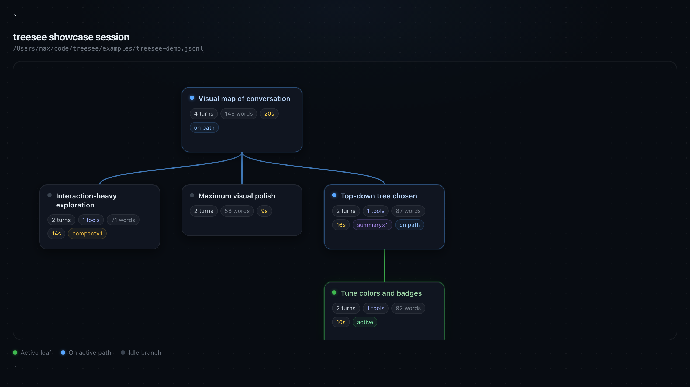

# treesee

A polished **HTML-only** conversation tree viewer for [pi](https://github.com/badlogic/pi-mono).

`/treesee` turns a pi session into a clean, top-down branch map with:

- automatic branch summaries
- active-path highlighting
- turn / tool / word / duration badges
- hover details
- session selection across current project or all projects

No terminal tree view. That part is intentionally gone.

## Screenshot



## Install

From git:

```bash
pi install git:github.com/maxsumrall/treesee
```

Or from a local checkout:

```bash
pi install /absolute/path/to/treesee
```

Then reload pi:

```bash
/reload
```

## Usage

```text
/treesee
/treesee select
/treesee all
/treesee /absolute/path/to/session.jsonl
```

## What it does

Treesee collapses a raw pi session into **branch nodes** instead of showing every raw session entry.

Visible branch content comes from:

- user messages
- assistant messages
- branch summaries
- compaction entries

Each branch gets a short label from:

1. cached LLM summary
2. branch summary text
3. compaction summary text
4. the first user message
5. the first assistant message
6. assistant tool names

## Why this exists

Pi session trees are powerful, but once you fork a few times they get noisy fast.

Treesee is the “show me the shape of the conversation” view:

- what branches exist
- which one is active
- how big each branch is
- what each branch was trying to do

## Example session

A small showcase session lives here:

```text
examples/treesee-demo.jsonl
```

It is intentionally synthetic and designed to show off branching, summaries, and compaction badges in the UI.

## Notes

- Branch summaries use your **currently selected pi model**.
- Labels are cached on disk under:

```text
~/.pi/agent/extensions/treesee/cache.json
```

## Package layout

This repo is a normal pi package:

- `index.ts` — extension entrypoint
- `examples/treesee-demo.jsonl` — showcase session
- `docs/treesee-example.png` — screenshot used in the README

## License

MIT
